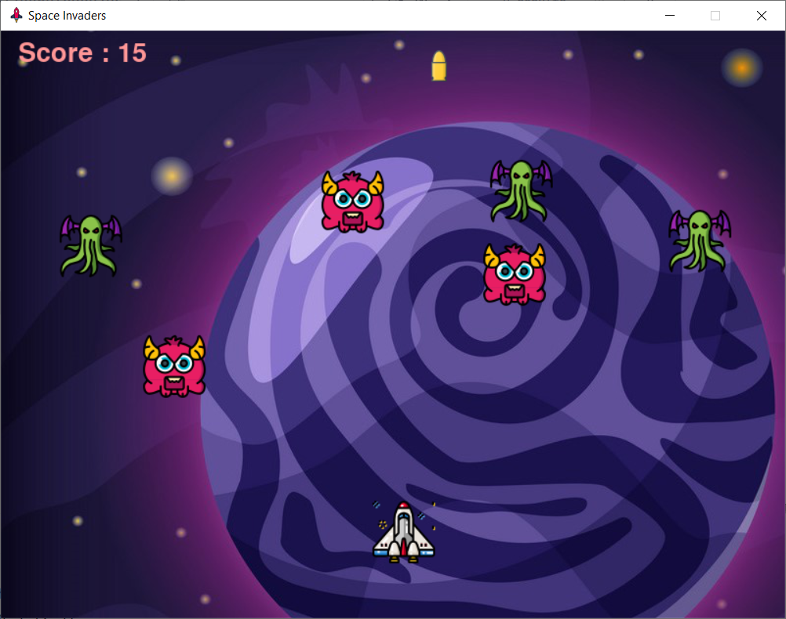

## Space Invader game
A classic Space Invaders clone built using Python and Pygame.
You control a spaceship that can move left and right and shoot bullets to destroy incoming enemies before they reach you.
The game features sound effects, scoring, and a replay option!

### Features:

🌟 Game logic — movements, collisions, states, boundaries, scores

🌟 Multiple enemies with random spawning and independent motion

🌟 Sound effects + background music with pygame.mixer

🌟 Smooth animations and clean UI

### Game Overview:
- Move your spaceship horizontally using arrow keys.
- Shoot enemies using the space bar.
- Each enemy destroyed increases your score.
- The game ends when any enemy reaches too close to your ship.
- After Game Over, the final score is shown and you can play again.

